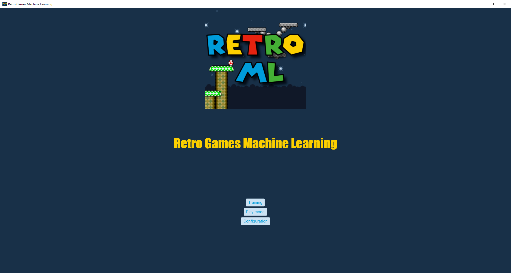

# Super Mario World - Machine Learning
A project by Tourmi & Voltage98 
--------
Training a Super Mario World AI that's able to beat levels on its own, as well as completing or optimizing various objectives  
[License](LICENSE)

## When cloning
It is important to either clone the repository recursively to include the submodules, or initialize the submodules after cloning, as they need to be built for the program compilation to actually work.

## Prerequisites
* Must be on Windows
* .NET SDK 6.0 or higher must be installed
* Microsoft Visual C++ 2010 SP1 Runtime (x64) must be installed for Bizhawk to run

## Building the dependencies
Run these commands starting from the root of the repository

### SharpNEAT
```
cd .\Submodules\SharpNEAT\src\
dotnet build --configuration Release
```

### BizHawk
```
cd .\Submodules\BizHawk\Dist\
.\QuickTestBuildAndPackage.bat
```

## Building the application
```
cd .\SMW-ML\
dotnet build --configuration Release
```

## Running the application
To run the application, you first need to copy a Super Mario World rom file to the root directory of the program. It must be named "swm.sfc" exactly.

## Using the application

### Main page

#### 
* **[Start training](#training-page)**
* **Load population**
  * Loads an existing population (xyz.pop) into the program. Allows to continue training a population after closing and reopening the application.
* **Save population**
  * Saves the population that's been trained for at least one generation.
* **[Training Configuration](#configuration)**

### Training Page

#### 
When entering this page, the training of AIs will be started automatically, using the [app's configuration](#configuration). Note that the UI might be unresponsive if too many emulator instances are running at once. Please do not close any emulators manually, as this will break the application.
* **Neural Network visualization**
  * Shows the first emulator's neural network structure and values. When the emulators finish booting, the emulator being represented will be the one on the bottom. The refresh rate of the preview will depend on the computer's performances, and having too many emulators running at once will affect it.
* **Stop Training**
  * Will stop training at the end of the current generation. Please be patient if the population size is big, and not many emulators are running at once. It will return to the [main page](#main-page) once it is done.

### Configuration

#### Neural Network

* **Number of AIs**
  * Determines the total population size of the training. Making it too big will make evolution really slow, while making it too small will make break-throughs extremely rare.
* **Species count**
  * Determines the number of species to use for the NEAT algorithm. A higher value will make breakthroughs more common while training, but a value that's too high will be detrimental to the evolution of the individual species. The amount of AIs per species is equal to `Number of AI / Species Count`
* **Elitism proportion**
  * The percentage of species to keep in each generation. Should be higher than 0, but lower than 1. New species will be created from the species that are kept, either by sexual reproduction, or asexual reproduction
* **Selection proportion**
  * The percentage of AIs to keep between each generation, within a species. Should be higher than 0, but lower or equal to 1. New AIs will be created within the species based on the AIs that are kept.

#### Application

* **Multithread**
  * This is the amount of emulators which will be booted while training. It is recommended to not put this value higher than the amount of cores within your computer, as performance will be greatly affected. For the fastest training, at the cost of using up all of the CPU resources available, set to the exact amount of cores in your computer. Otherwise, set to a lower value.
* **Communication Port with Arduino**
  * Communication port with an Arduino that's connected to the PC. Should be left like it is if no arduinos are connected. Used so we can preview the inputs on an actual physical controller.
  * [See ./ArduinoSNESController](ArduinoSNESController)

#### Objectives

This page lists all of the available training objectives. Some of them cannot be disabled, but the multiplier can be set to 0 so it won't affect the score, at least. The values pictured are the recommended values when training AIs from nothing, but you may experiment at your leisure.
* **Enabled**
  * Whether or not this objective will affect the score.
  * Also, if the objective has a stop condition, the stop condition will not actually stop the level if it is disabled.
* **Multiplier**
  * The amount by which to multiply the objective's score.

##### Objectives information
* **Died**
  * The amount of points to attribute to an AI that died. 
  * It is recommended to set this value to a negative value to discourage AIs from killing themselves.
* **Distance travelled**
  * Points to attribute for each tile the AI traverses. This is based on the maximum distance, so going back and forth will not give more points.
* **Stopped moving**
  * Stops the current level if the AI has stopped progressing through the level. This is based on the maximum distance reached so far, not the current position.
  * It is recommended to leave this enabled, but you may disable it if you want AIs to stay on the level for up to the maximum duration.
  * A negative amount of points is recommended to discourage the AI from idling, moving back and forth, and looping forever.
* **Time taken**
  * Gives some points based on the amount of seconds the AI had left before its training being shutdown. 
  * Note that these points are given even if the AI died or stopped moving.
  * Do not set this value too high unless you also raise the penalty for dying and not moving, as the AI might be encouraged to kill itself or idle as soon as possible to max out its score.
* **Won level**
  * The amount of points to attribute if the AI wins a level. Ideally, this should be a high value to encourage actually finishing levels.
* **Coins**
  * The amount of points to give the AI per coin collected.
* **Yoshi Coins**
  * The amount of points to give the AI per Yoshi Coin collected
* **1-ups**
  * The amount of points to give the AI per 1-up collected from any source.
* **High Score**
  * The amount of points to give the AI for its displayed high-score, divided by 1000. So a high-score of 55200 with a multiplier of 2 will give a total amount of points of 110.4 to the AI.