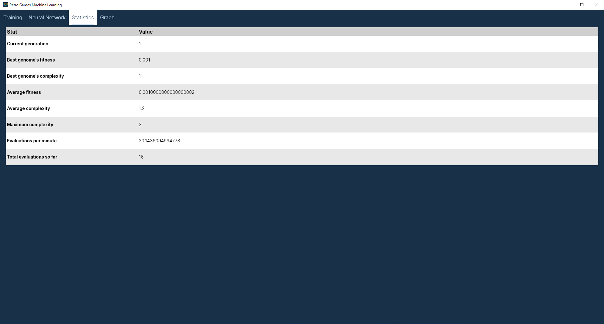
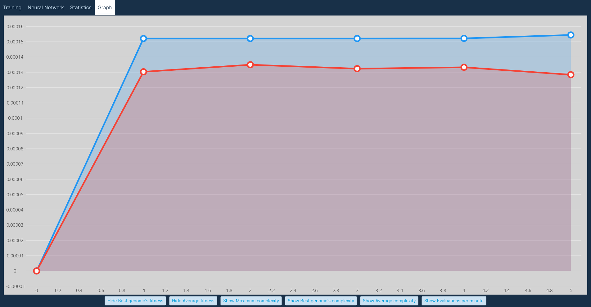
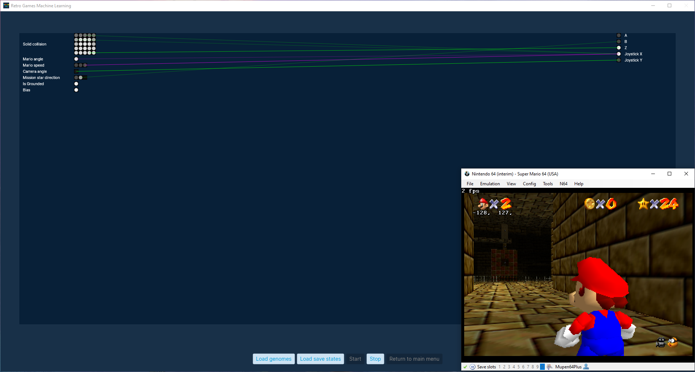
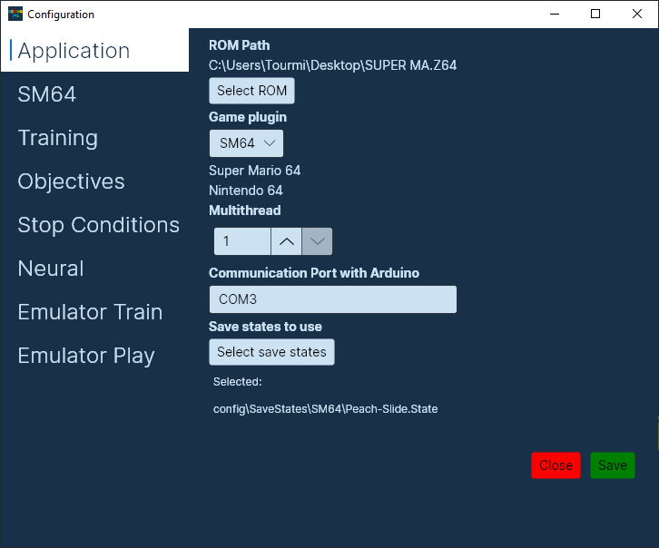
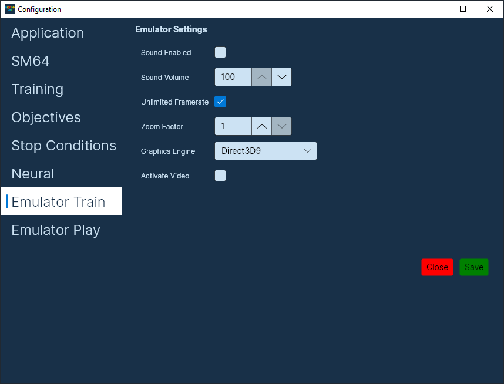

# Retro Machine Learning
A project by Tourmi, Voltage98 & Jaewongtongsoup
--------
Training AIs that are able to get better at various games, as well as completing or optimizing various objectives

[MIT License](LICENSE)

## When cloning
It is important to either clone the repository recursively to include the submodules, or initialize the submodules after cloning, as they need to be built for the program compilation to actually work.

```
git submodule update --init
```

## Prerequisites
* Must be on Windows
* .NET SDK 6.0 or higher must be installed
* Microsoft Visual C++ 2010 SP1 Runtime (x64) must be installed for Bizhawk to run
* Microsoft Visual C++ Redistributable for Visual Studio 2015, 2017 and 2019

## Available game plugins
* [Super Mario World (SMW)](Games/Retro_ML.SuperMarioWorld)
* [Super Mario Kart (SMK)](Games/Retro_ML.SuperMarioKart)
* [Super Mario Bros (SMB)](Games/Retro_ML.SuperMarioBros)
* [Tetris (Tetris)](Games/Retro_ML.Tetris)
* [Metroid (Metroid)](Games/Retro_ML.Metroid)
* [Street Fighter 2 Turbo (SF2T)](Games/Retro_ML.StreetFighter2Turbo)
* [Pokemon Red/Blue/Yellow (PokemonGen1)](Games/Retro_ML.PokemonGen1)
* [Super Bomberman 3 (SB3)](Games/Retro_ML.SuperBomberman3)
* [Super Mario 64 (SM64)](Games/Retro_ML.SuperMario64)

## Building the dependencies
Run these commands starting from the root of the repository. Alternatively, you may use the `build.bat` script.

### SharpNEAT
```
cd .\Submodules\SharpNEAT\src\
dotnet build --configuration Release
```

### BizHawk
```
cd .\Submodules\BizHawk\Dist\
call QuickTestBuildAndPackage.bat
```

## Building the application
```
dotnet build --configuration Release
xcopy /e /i ".\Application\bin\Release\net6.0" ".\bin\"
```

## Running the application
You may use the `run.bat` file to run the program, once the `build.bat` script was run successfully.

You will need to provide a ROM file in the configuration for the game you want to train on.

## Using the application

### Main page
  

* **[Training](#training-page)**
* **[Play mode](#play-mode)**
* **[Training Configuration](#configuration)**

### Training Page
On this page, you can start training AIs, and supervise their progress. When starting a new training session, a folder will be created at the location of the executable, with a name similar to `SM64-20220708-180530`, depending on the chosen game and the current date and time. The folder contains the current neural configuration, so that it can easily be loaded later on, as well as the current game plugin configuration. It also contains the latest population file `current.pop`, so that training can be resumed later on. Finally, it contains a `genomes/` folder, where the  best genome is saved at each generation when it improved.

The training page consists of the following tabs

#### Training Tab


* **Start training**
  * Starts the training of AIs, using the [app's configuration](#configuration). Note that the UI might be unresponsive if too many emulator instances are running at once. Please do not close any emulators manually, as this will break the application.
* **Stop Training**
  * Will stop training at the end of the current generation. Please be patient if the population size is big, and not many emulators are running at once.
* **Force Stop**
  * Will immediately stop the training, if you do not wish to wait for the current generation to end. Note that the latest generation will be forfeit, and won't be saved or update the statistics.
* **Load population**
  * Loads an existing population (xyz.pop) into the program. Allows to continue training a population after closing and reopening the application.
* **Open Training Folder**
  * Opens the path at which the training folders exist.
* **Return to main menu**
  * Returns to the [main page](#main-page)

#### Neural Network Tab

**Neural Network visualization**

Shows the first emulator's neural network structure and values. Colored/white nodes are On/positive, grey nodes are Off/null, and black nodes are negative. The state of middle nodes is not represented. Magenta connections are negative connections, and green ones, positive.

When the emulators finish booting, the emulator being represented will be the one that was booted first. The refresh rate of the preview will depend on the computer's performances, and having too many emulators running at once will affect it.

It is recommended to not stay on this page for too long, as it will affect the speed of the training session.

More information on the inputs and outputs of the neural network can be found in the [configuration](#Neural).

#### Statistics Tab
  

This tab shows statistics of the current training session. They are updated at the end of every generation.
* **Current generation**
  * Shows the current generation number. Note that this number is reset whenever starting a new training session, even after loading an existing population.
* **Best genome's fitness**
  * The best AI's current score.
* **Best genome's complexity**
  * The amount of connections in the neural network of the best AI.
* **Average fitness**
  * The average score of all the AIs.
* **Average complexity**
  * The average complexity (amount of connections in the neural network) of all the AIs.
* **Maximum complexity**
  * The maximum complexity of all the AIs.
* **Evaluations per minute**
  * The amount of AIs that are evaluated per minute.
* **Total evaluations so far**
  * The amount of AIs evaluated since the start of the training session.

#### Graph Tab


This tab shows a graph of the different stats mapped over the training generations. It is possible to filter which stats to preview. Please refer to the stats in the [statistics tab](#statistics-tab) for information on what the different values represent.

### Play Mode
  

This page is used to make specific genomes play on specific levels, both of them being manually selected. It is a good way to check the abilities of a genome on levels that aren't part of its training-set, or even previewing the capabilities of the resulting genomes from a training session.

Note that, if loading multiple savestates and genomes, a single genome will be played on each savestates before switching to the next. Play mode will stop automatically once all genomes went through all savestates.

* **Load genomes**
  * Loads the genomes to use for the play mode. Selecting new genomes while the play mode is running reloads the first save state and starts it again using the new genomes.
* **Load save states**
  * Loads the save states to use for the play mode. Selecting new save states while the play mode is running will load them into the emulator right away.
* **Start**
  * Starts up the AIs with the given save states. Can only be started when save states and genomes have been provided.
* **Stop**
  * Stops the emulator execution.
* **Exit**
  * Exits play mode. Only enabled once play mode has been stopped.

### Configuration

#### Application
  

* **ROM Path**
  * The path to the ROM file. Clicking the `Select ROM` button allows to select a new ROM.
* **Game Plugin**
  * The game plugin to use for the ROM. The available plugins will be the ones present in the `./plugins/` folder.
  * Below this dropdown will have the human-readable name for the selected Game plugin, as well as the console plugin it's using.
* **Multithread**
  * This is the amount of emulators which will be booted while training. It is recommended to not put this value higher than the amount of cores/thread within your computer, as performance will be greatly affected. For the fastest training, at the cost of using up all of the CPU resources available, set to the exact amount of cores in your computer. Otherwise, set to a lower value.
* **Communication Port with Arduino**
  * Communication port with an Arduino that's connected to the PC. Should be left like it is if no arduinos are connected. Used so we can preview the inputs on an actual physical controller.
  * [See ./ArduinoSNESController](ArduinoSNESController)
* **Save states to use**
  * By clicking the button, you can select the save states you want to use for training. At least one must be selected.

#### Game Plugin
  
This tab's name changes to the current game's plugin name when a new plugin is loaded. The configuration on this page is unique for the currently loaded game plugin, so refer to the plugin's `README.md` for information on the different fields.

#### Training
  

* **Number of AIs**
  * Determines the total population size of the training. Making it too big will make evolution really slow, while making it too small will make break-throughs extremely rare.
* **Initial connections**
  * We recommend leaving this option at 0, but it allows the specification of a percentage of predefined connections when training a new AI. 
  * Should be higher or equal to 0, but lower than 1.
* **Species count**
  * Determines the number of species to use for the NEAT algorithm. A higher value will make breakthroughs more common while training, but a value that's too high will be detrimental to the evolution of the individual species. 
  * The amount of AIs per species is equal to `Number of AI / Species Count`
* **Elitism proportion**
  * The percentage of species to keep in each generation. New species will be created from the species that are kept, either by sexual reproduction, or asexual reproduction.
  * Should be higher than 0, but lower than 1. 
* **Selection proportion**
  * The percentage of AIs to keep between each generation, within a species. New AIs will be created within the species based on the AIs that are kept.
  * Should be higher than 0, but lower or equal to 1.

#### Objectives
  

This page lists all of the available training objectives. Some of them cannot be disabled, but the multiplier can be set to 0 so it won't affect the score, at least. Please refer to your current game plugin's `README.md` for information about specific objectives.

Note that for objectives, the term "Reward" also refers to negative rewards, or punishments.
Turning off an objective also turns off its stop condition.

* **Enabled**
  * Whether or not this objective will affect the score.
  * Also, some objectives cut the training short when a certain condition is satisfied (Dying for `Died`, completing the level for `Won level`, etc). This behaviour is disabled when the objective is disabled.
* **Multiplier**
  * The amount by which to multiply the objective's reward.

#### Stop Conditions


This page lists the available stop conditions for training sessions. Satisfying any of the enabled conditions will stop a training session.

* **Stop when fitness reached**
  * Will stop the training session once the best genome reaches the target fitness specified.
* **Stop after X generations**
  * Will stop the training session once the specified amount of generations is reached.
* **Stop when plateau reached**
  * Will stop the training session once an AI has stopped improving over the specified amount of generations.
* **Stop after X minutes**
  * Will stop the training session after the specified amount of minutes.

#### Neural
  

This page lists all of the inputs and outputs that can be toggled for the neural networks, as well as the distance (in tiles) that the AI can see.  
⚠ Changing any of these values will make previously trained AIs incompatible with the application ⚠

Refer to the current game plugin's `README.md` for information about the different Neural Inputs/Outputs.

* **Short Term Memory Cells Count**
  * How many short term memory cells the AI has available to write to and read from.
  * These cells are written to on every evaluation.
* **Long Term Memory Cells Count**
  * How many long term memory cells the AI has available to write to and read from.
  * The AIs can choose whether or not to write to these cells.
* **Permanent Memory Cells Count**
  * How many permanent memory cells the AI has available to write to and read from.
  * The AIs can choose whether or not to write to these cells.
  * Once written to, the AI may no longer write to it, making it unmutable until the next save state is loaded.
* **Maximum Memory Value**
  * The maximum value the AI may write to a memory cell, be it a negative or positive value.
  * Recommended to leave this value at 1.0 so that memory cells remain normalized.

##### Emulator tabs


There are 2 emulator tabs, one for the config of emulators used during a training session, and one for the emulator used in the Play Mode.
Note that most of these settings can also be changed in the emulator itself.

* **Sound Enabled**
  * Toggles the sound for the emulator. Recommended to leave it off for training emulators, as they can get quite noisy.
* **Sound Volume**
  * The volume setting of the emulator. Value between 0 and 100.
* **Unlimited framerate**
  * Whether or not to allow the emulator to run at an uncapped framerate. Recommended to leave this on for training emulators, and off for the play mode emulator.
* **Zoom Factor**
  * The scaling factor of the emulators. A smaller value is recommended for training emulators, since a lot of windows can be open at once.
* **Graphics Engine**
  * The graphics engine to use for the emulator instances. Leave this to its default value, unless the emulators have trouble running properly.
* **Activate Video**
  * If video is deactivated, the emulator will only show a black screen. Can be used on training emulators to allow a slightly more performant training session.
