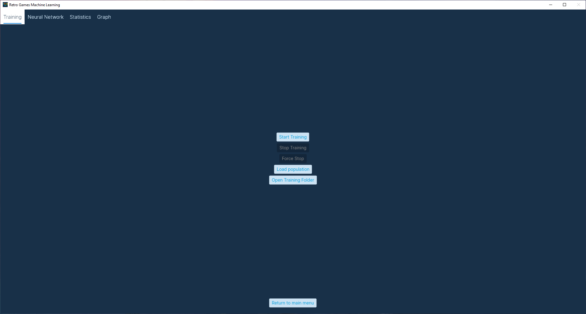
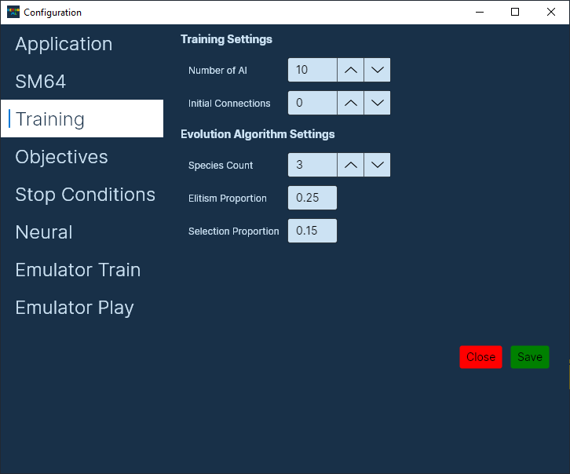
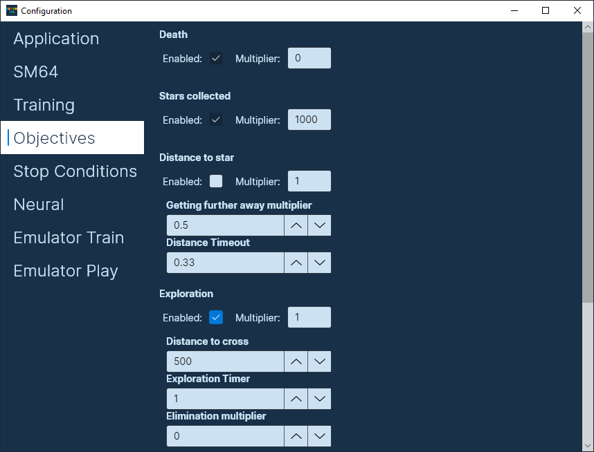
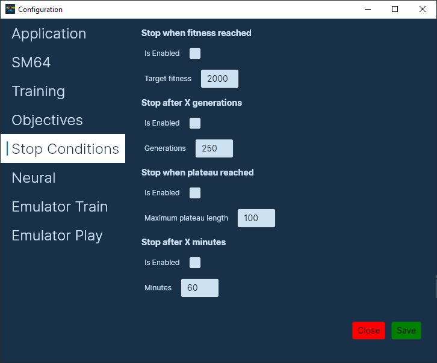
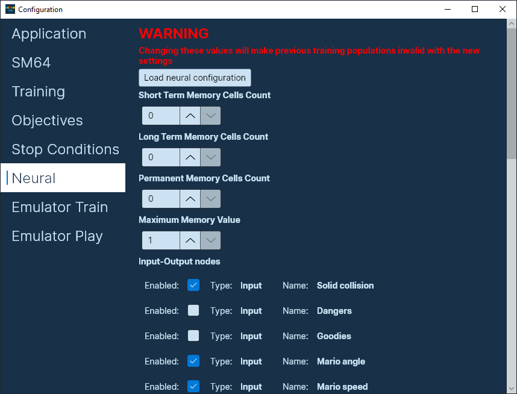

# Super Mario World - Machine Learning
A project by Tourmi & Voltage98 
--------
Training a Super Mario World AI that's able to beat levels on its own, as well as completing or optimizing various objectives

[MIT License](LICENSE)

## When cloning
It is important to either clone the repository recursively to include the submodules, or initialize the submodules after cloning, as they need to be built for the program compilation to actually work.

```
git submodule update --init
```

## Prerequisites
* Must be on Windows
* .NET SDK 6.0 or higher must be installed
* Microsoft Visual C++ 2010 SP1 Runtime (x64) must be installed for Bizhawk to run
* Microsoft Visual C++ Redistributable for Visual Studio 2015, 2017 and 2019
* A Super Mario World ROM File

## Building the dependencies
Run these commands starting from the root of the repository. Alternatively, you may use the `buildDependencies.bat` script.

### SharpNEAT
```
cd .\Submodules\SharpNEAT\src\
dotnet build --configuration Release
```

### BizHawk
```
cd .\Submodules\BizHawk\Dist\
call QuickTestBuildAndPackage.bat
```

## Building the application
```
cd .\SMW-ML\
dotnet build --configuration Release
```

## Running the application
You may use the `run.bat` file to run the program, once the dependencies are built.

You will need to provide a Super Mario World ROM file through the configuration if the root directory of the program doesn't contain the ROM file (`smw.sfc`).

## Using the application

### Main page
  

* **[Training](#training-page)**
* **[Play mode](#play-mode)**
* **[Training Configuration](#configuration)**

### Training Page
On this page, you can start training AIs, and supervise their progress. When starting a new training session, a folder will be created at the location of the app. The folder contains the current neural configuration, so that it can easily be loaded later on. It also contains the latest population file `current.pop`, so that training can be resumed. And it contains a `genomes/` folder, where the current best genome is saved, whenever it is improved.

The training page consists of the following tabs

#### Training Tab


* **Start training**
  * Starts the training of AIs, using the [app's configuration](#configuration). Note that the UI might be unresponsive if too many emulator instances are running at once. Please do not close any emulators manually, as this will break the application.
* **Stop Training**
  * Will stop training at the end of the current generation. Please be patient if the population size is big, and not many emulators are running at once.
* **Force Stop**
  * Will immediately stop the training, if you do not wish to wait for the current generation to end. Note that the latest generation will be forfeit, and won't be saved or update the statistics.
* **Load population**
  * Loads an existing population (xyz.pop) into the program. Allows to continue training a population after closing and reopening the application.
* **Save population**
  * Saves the population that's been trained to a file.
* **Exit**
  * Returns to the [main page](#main-page)

#### Neural Network Tab

**Neural Network visualization**

Shows the first emulator's neural network structure and values. Colored/white nodes are On, dark nodes are Off. The state of middle nodes is not represented. Magenta connections are negative connections, and green ones, positive.

When the emulators finish booting, the emulator being represented will be the one that was booted first. The refresh rate of the preview will depend on the computer's performances, and having too many emulators running at once will affect it.

It is recommended to not stay on this page for too long, as it will affect the speed of the training session.

More information on the inputs and outputs of the neural network can be found in the [configuration](#Neural).

#### Statistics Tab
  

This tab shows statistics of the current training session. They are updated at the end of every generation.
* **Current generation**
  * Shows the current generation number. Note that this number is reset whenever starting a new training session, even after loading an existing population.
* **Best genome's fitness**
  * The best AI's current score.
* **Best genome's complexity**
  * The amount of connections in the neural network of the best AI.
* **Average fitness**
  * The average score of all the AIs.
* **Average complexity**
  * The average complexity (amount of connections in the neural network) of all the AIs.
* **Maximum complexity**
  * The maximum complexity of all the AIs.
* **Evaluations per minute**
  * The amount of AIs that are evaluated per minute.
* **Total evaluations so far**
  * The amount of AIs evaluated since the start of the training session.

#### Graph Tab


This tab shows a graph of the different stats mapped over the training generations. It is possible to filter which stats to preview. Please refer to the stats in the [statistics tab](#statistics-tab) for information on what the different values represent.

### Play Mode
  

This page is used to make specific genomes play on specific levels, both of them being manually selected. It is a good way to check the abilities of a genome on levels that aren't part of its training-set, or even previewing the capabilities of the resulting genomes from a training session.

* **Load Genome**
  * Loads the genome to use for the play mode. Selecting a new genome while the play mode is running reloads the save state and starts it again using the new genome.
* **Load save state**
  * Loads the save state to use for the play mode. Selecting a new save state while the play mode is running will load it into the emulator right away.
* **Start**
  * Loads the save state and starts up the AI. Can only be started when a save state and a genome have been provided.
* **Stop**
  * Stops the current AI from running.
* **Exit**
  * Exits play mode. Only enabled once play mode has been stopped.

### Configuration

#### Application
  

* **ROM Path**
  * The path to the Super Mario World ROM file. Clicking the `Select ROM` button allows to select a new ROM.
* **Multithread**
  * This is the amount of emulators which will be booted while training. It is recommended to not put this value higher than the amount of cores within your computer, as performance will be greatly affected. For the fastest training, at the cost of using up all of the CPU resources available, set to the exact amount of cores in your computer. Otherwise, set to a lower value.
* **Communication Port with Arduino**
  * Communication port with an Arduino that's connected to the PC. Should be left like it is if no arduinos are connected. Used so we can preview the inputs on an actual physical controller.
  * [See ./ArduinoSNESController](ArduinoSNESController)
* **Save states to use**
  * By clicking the button, you can select the save states you want to use for training. At least one must be selected.

#### Training
  

* **Number of AIs**
  * Determines the total population size of the training. Making it too big will make evolution really slow, while making it too small will make break-throughs extremely rare.
* **Initial connections**
  * We recommend leaving this option at 0, but it allows the specification of a percentage of predefined connections when training a new AI. Should be higher or equal to 0, but lower than 1.
* **Species count**
  * Determines the number of species to use for the NEAT algorithm. A higher value will make breakthroughs more common while training, but a value that's too high will be detrimental to the evolution of the individual species. The amount of AIs per species is equal to `Number of AI / Species Count`
* **Elitism proportion**
  * The percentage of species to keep in each generation. Should be higher than 0, but lower than 1. New species will be created from the species that are kept, either by sexual reproduction, or asexual reproduction
* **Selection proportion**
  * The percentage of AIs to keep between each generation, within a species. Should be higher than 0, but lower or equal to 1. New AIs will be created within the species based on the AIs that are kept.

#### Objectives
  

This page lists all of the available training objectives. Some of them cannot be disabled, but the multiplier can be set to 0 so it won't affect the score, at least. The values pictured are the recommended values when training AIs from nothing, but you may experiment at your leisure.

* **Enabled**
  * Whether or not this objective will affect the score.
  * Also, some objectives cuts the training short when a certain condition is satisfied (Dying for `Died`, completing the level for `Won level`, etc). This behaviour is disabled when the objective is disabled.
* **Multiplier**
  * The amount by which to multiply the objective's score.

##### Objectives information

* **Died**
  * The amount of points to attribute to an AI that died. 
  * It is recommended to set this value to a negative value to discourage AIs from killing themselves.
* **Distance travelled**
  * Points to attribute for each tile the AI traverses. This is based on the maximum distance, so going back and forth will not give more points.
  * The AI must be grounded for points to be attributed, so jumping down a pit will not give extra points.
  * East, West, Up, Down multipliers
    * Specific multipliers for distance traveled in the respective directions. These are multiplied with the objective's multiplier.
* **Stopped moving**
  * Stops the current level if the AI has stopped progressing through the level. This is based on the maximum distance reached so far, not the current position.
  * It is recommended to leave this enabled, but you may disable it if you want AIs to stay on the level for up to the maximum duration.
  * A negative amount of points is recommended to discourage the AI from idling, moving back and forth, and looping forever.
* **Time taken**
  * Gives points when the AI takes way too long to complete a level. Recommended to set to a negative value and leave enabled in case AIs decide to take way too much time on a level.
* **Speed**
  * Gives points based on the speed of the AI. 
  * The formula is `(Maximum Tiles distance / Seconds taken) * Multiplier * Direction Multiplier`
  * Horizontal and vertical multipliers
    * Additional multipliers for the direction of the AI. 
* **Won level**
  * The amount of points to attribute if the AI wins a level. Ideally, this should be a high value to encourage actually finishing levels.
  * Goal and Key multipliers
    * Set one of these to 0 or a negative value if you want to prioritize finishing a level with a key, or through the regular level ending.
* **Coins**
  * The amount of points to give the AI per coin collected.
* **Yoshi Coins**
  * The amount of points to give the AI per Yoshi Coin collected
* **1-ups**
  * The amount of points to give the AI per 1-up collected from any source.
* **High Score**
  * The amount of points to give the AI for its in-game high-score.
  * The formula is `(In-game High Score / 1000) * Multiplier`
  * So a high-score of 55200 with a multiplier of 2 will give a total amount of points of 110.4 to the AI.
* **Power Up**
  * Points given whenever the AI collects a power up it didn't have yet.
  * Mushroom, Cape, Flower multipliers
    * Additional multiplier for the type of power-up collected. If the global multiplier is 4, and the cape multiplier is 2, then the AI is awarded 8 points for collecting a Cape.
* **Taken Damage**
  * Points applied whenever an AI takes damage, not counting dying. 

#### Stop Conditions


This page lists the available stop conditions for training sessions. Satisfying any of the enabled conditions will stop a training session.

* **Stop when fitness reached**
  * Will stop the training session once the best genome reaches the target fitness specified.
* **Stop after X generations**
  * Will stop the training session once the specified amount of generations is reached.
* **Stop when plateau reached**
  * Will stop the training session once an AI has stopped improving over the specified amount of generations.
* **Stop after X minutes**
  * Will stop the training session after the specified amount of minutes.

#### Neural
  

This page lists all of the inputs and outputs that can be toggled for the neural networks, as well as the distance (in tiles) that the AI can see.  
⚠ Changing any of these values will make previously trained AIs incompatible with the application ⚠
* **Load neural configuration**
  * This button allows the loading of the neural configuration of previous training sessions
* **Use vision grid**
  * Toggling this toggles between the usage of vision rays, or a vision grid for AIs.
* **Vision Ray Distance**
  * The maximum distance for vision rays, in tiles. It is recommended to leave this setting at 10, but if you wish to restrict the distance at which AIs can see, feel free to tweak it.
* **Vision ray count**
  * The total amount of vision rays to throw around Mario. All vision rays are spread evenly. It is recommended to leave this at 16, as 8 doesn't give too much information, and 32 mostly gives back redundant information.
* **View distance horizontal** `VDH`
  * The horizontal distance that the AI can see for, in tiles, not including the tile the AI is on. This means that if we set both the horizontal and vertical distances to 4, a 9x9 grid of inputs will be used.
* **View distance vertical** `VDV`
  * The vertical distance that the AI can see for, in tiles, not including the tile the AI is on. This means that if we set both the horizontal and vertical distances to 4, a 9x9 grid of inputs will be used.
* **Internal Clock Tick Length**
  * The length of a single tick in the internal clock.
* **Internal Clock Length**
  * The amount of nodes the internal clock has.
* **Input nodes**
  * Tiles : The tiles the AI can stand on. `(VDH * 2 + 1) * (VDV * 2 + 1)` total nodes, if using a vision grid.
  * Dangers : The dangerous tiles around the AI. Includes dangerous tiles as well as dangerous sprites. `(VDH * 2 + 1) * (VDV * 2 + 1)` total nodes, if using a vision grid
  * Goodies : The "good" tiles around the AI. Includes coins, powerups, blocks that contain items. `(VDH * 2 + 1) * (VDV * 2 + 1)` total nodes, if using a vision grid.
  * Water : The water tiles around the AI. `(VDH * 2 + 1) * (VDV * 2 + 1)` total nodes, if using a vision grid.
  * On ground : Whether or not the AI is touching the ground.
  * In water : Whether or not the AI is in water
  * Raising : Whether or not the AI is raising, both out of a jump as well as while swimming.
  * Sinking : Whether or not the AI is falling, both out of a jump as well as while swimming.
  * Can jump out of water : Whether or not the AI will get out of the water by jumping.
  * Carrying : Whether or not the AI is carrying something.
  * Can Climb : ⚠Not guaranteed to always be right. Whether or not the AI can climb at the moment.
  * Max Speed : Whether or not the AI has reached maximum speed.
  * Message box : Whether or not there currently is a message box open.
  * Internal clock : Timed bias value. Alternates between on and off every couple frames.
  * Bias : Bias value. Always on.
* **Output nodes**
  * The output nodes are self-explanatory, there is one for each button available on an SNES controller.
  
##### Emulator tabs


There are 2 emulator tabs, one for the config of emulators used during a training session, and one for the emulator used in the Play Mode.
Note that most of these settings can also be changed in the emulator itself.

* **Sound Enabled**
  * Toggles the sound for the emulator. Recommended to leave it off for training emulators, as they can get quite noisy.
* **Sound Volume**
  * The volume setting of the emulator. Value between 0 and 100.
* **Unlimited framerate**
  * Whether or not to allow the emulator to run at an uncapped framerate. Recommended to leave this on for training emulators, and off for the play mode emulator.
* **Zoom Factor**
  * The scaling factor of the emulators. A smaller value is recommended for training emulators, since a lot of windows can be open at once.
* **Graphics Engine**
  * The graphics engine to use for the emulator instances. Leave this to its default value, unless the emulators have trouble running properly.
* **Activate Video**
  * If video is deactivated, the emulator will only show a black screen. Can be used on training emulators to allow a slightly more performant training session.
